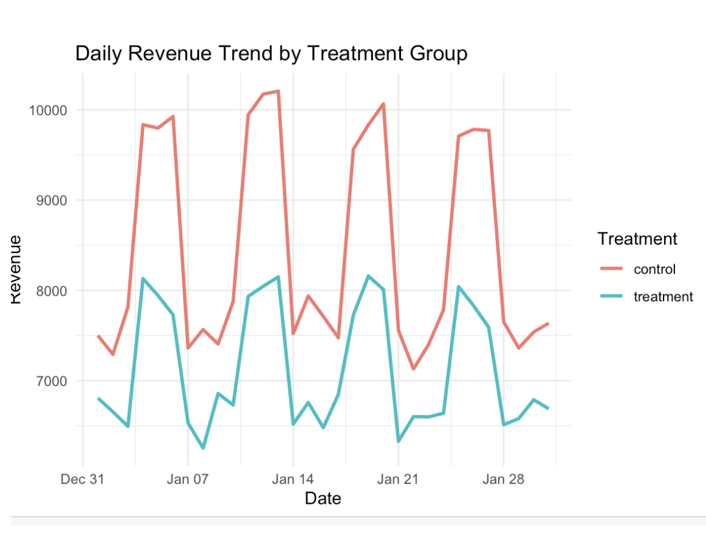
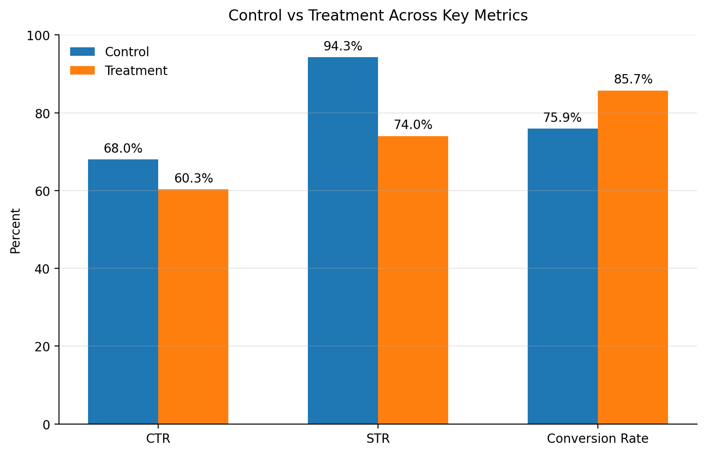

# Ad Targeting A/B Testing Analysis

## Key Results

- Enforcing geographic constraints reduced click-through rate from 68.0% to 60.3%, lowering total engagement under the treatment condition  
- Conversion rate increased from 75.9% to 85.7%, indicating improved alignment between users and displayed ads  
- Sell-through rate declined from 94.3% to 74.0%, reflecting a reduction in eligible ad inventory  
- Total revenue decreased by 15.7%, driven by reduced click volume despite higher conversion efficiency  
- Statistical testing confirmed the revenue decline was significant, with sufficient power to detect the observed CTR effect  

---

This project evaluates how restricting the set of ads shown to users affects engagement, conversion behavior, and revenue outcomes. The analysis is framed as an A/B experiment comparing a baseline system against a constrained version where ads are limited to a narrower geographic range. 

The goal was to understand how changes to system design impact both user behavior and monetization. In practice, this reflects a common product decision problem: whether stricter targeting improves outcome quality without reducing overall engagement and revenue.

The analysis was implemented in R using `dplyr` for transformation and aggregation, `ggplot2` for visualization, and statistical testing libraries for inference. Metrics were computed at the treatment level to ensure consistent comparisons across control and constrained conditions.

A unified aggregation pipeline was used to compute all key performance metrics:

```r
metrics_summary <- data %>%
  mutate(
    click_flag = AdClick == "clicked",
    purchase_flag = Purchase == "yes"
  ) %>%
  group_by(Treatment) %>%
  summarise(
    impressions = n(),
    clicks = sum(click_flag),
    purchases = sum(purchase_flag),
    revenue = sum(Revenue),
    CTR = clicks / impressions,
    conversion_rate = purchases / clicks,
    STR = impressions / max(impressions),
    revenue_per_impression = revenue / impressions
  )
```

This structure allows all key metrics to be computed in a single pass, ensuring internal consistency across engagement and monetization measures.

Revenue impact was evaluated using a Welch t-test to account for unequal variance between treatment groups:

```r
t_test_revenue <- t.test(Revenue ~ Treatment, data = data)
```

Effect size and statistical power were then computed to validate that the observed differences were detectable given the experiment size:

```r
effect_size_ctr <- ES.h(
  p1 = metrics_summary$CTR[metrics_summary$Treatment == "control"],
  p2 = metrics_summary$CTR[metrics_summary$Treatment == "treatment"]
)

power_analysis <- pwr.2p.test(
  h = effect_size_ctr,
  n = min(table(data$Treatment)),
  sig.level = 0.05
)
```

Restricting the ad pool reduced the number of eligible impressions, directly lowering click volume. While the remaining ads were more relevant and converted at higher rates, the reduction in exposure dominated overall performance. This indicates that user engagement is not strictly bounded by geographic proximity and that users consider nearby alternatives when other attributes are favorable.

Revenue outcomes were driven primarily by scale. Under a pay-per-click model, total clicks contributed more to revenue than improvements in conversion efficiency. The decline in sell-through rate reflects reduced participation in the ad auction, limiting both competition and monetization potential.

The results highlight a core tradeoff between relevance and volume. Increasing targeting precision improves conversion efficiency but reduces the number of monetizable interactions. Effective system design requires balancing these effects rather than optimizing for a single metric.

---

## Outputs

**Daily Revenue Trend (Control vs Treatment)**  


**CTR, STR, and Conversion Comparison**  

